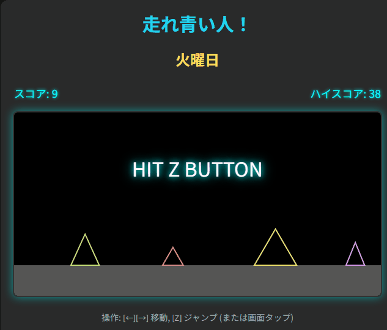

# 走れ青い人！ 🏃💨

## 🚀 公開ページ

[https://keigox68000.github.io/RunBlueMan/](https://keigox68000.github.io/RunBlueMan/)

## 🎮 これはなに？

「青い人」を操作して、月曜日から金曜日まで障害物を避けながら駆け抜ける、横スクロールアクションゲームです。
1週間を無事に乗り越えて、週末のご褒美カツカレーを目指しましょう！

## 📜 ルール

  - **操作:**
      - 左右カーソルキー ([←][→]): 移動
      - [Z] キー (または画面タップ): ジャンプ
  - **目的:**
      - 各曜日（ステージ）で、指定された数の障害物を避けてクリアします。
      - 金曜日をクリアするとオールクリアです！
  - **ステージ進行:**
      - 月曜日から始まり、金曜日へと進みます。
      - ステージが進むごとに、スクロール速度とプレイヤーの移動速度が少しずつ上がります。
  - **ご褒美:**
      - 各曜日をクリアするごとに、美味しいカツカレーが表示されます。カツカレーはステージが進むと少しずつ大きくなります！
  - **ゲームオーバー:**
      - 障害物に衝突するとゲームオーバーです。
      - ゲームオーバー後、またはオールクリア後、約5秒でデモ画面に戻ります。
  - **スタート:**
      - 最初はデモ画面が表示されています。「HIT Z BUTTON」の表示中に[Z]キーを押